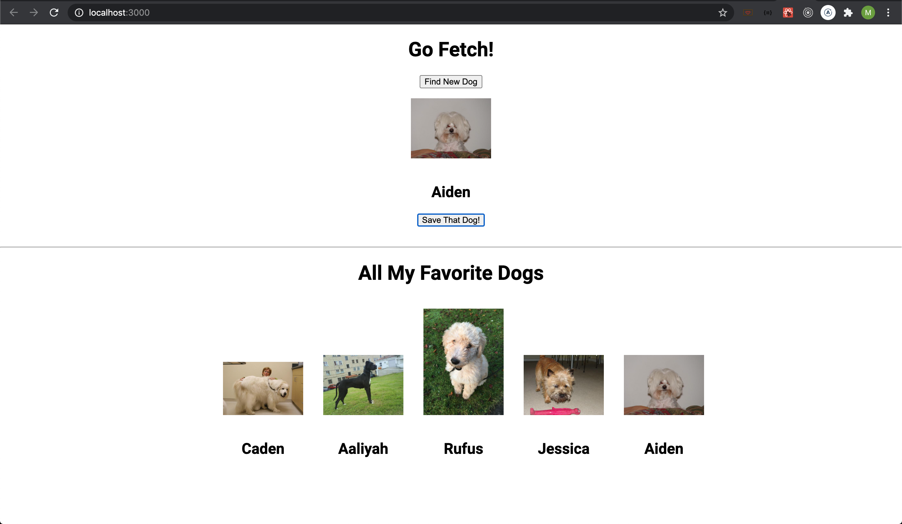

# Go Fetch!
## Play fetch and find some A+ pups

Create an application that lets users save their favorite dog pics. You will be given an api that returns a random dog picture along with a built in function that returns a random name. You should present your user with a randomly generated dog pic and name with the click of a button. The user can then either save that dog to their favorites or load another dog. Dogs saved in favorites should persist on the screen. Below is a simple example of what you could create.

Heres is an example of what you might create:

---------------------------------------------

# User Stories
- A user can load up the page, and they will see a random dog already, along with an empty favorites list
- A user can click a button to load a new dog
- A user can click a button to save the current random dog to the list of favorites
- When a user saves a dog, its name and photo should remain unchanged

## Stretch goals
- *Every dog is one of a kind*
  - There are so many good dogs, there is no room for duplicates. Make it so your app can't save duplicate images (identical names are fine though).

- *Super star the FAVORITE dog*
  - Add a button that lets users highlight their absolute favorite. A user should only be able to favorite one dog at a time.

- *Love is forever (until the cache is cleared)*
  - Let users save their dogs for another time. Favorites should persist across page reloads by living in the `localStorage`.

- *Give those dogs a nickname*
  - No one calls dogs by their real name, why should your users? Allow your users to give their favorite dogs a nickname that displays below their real name.